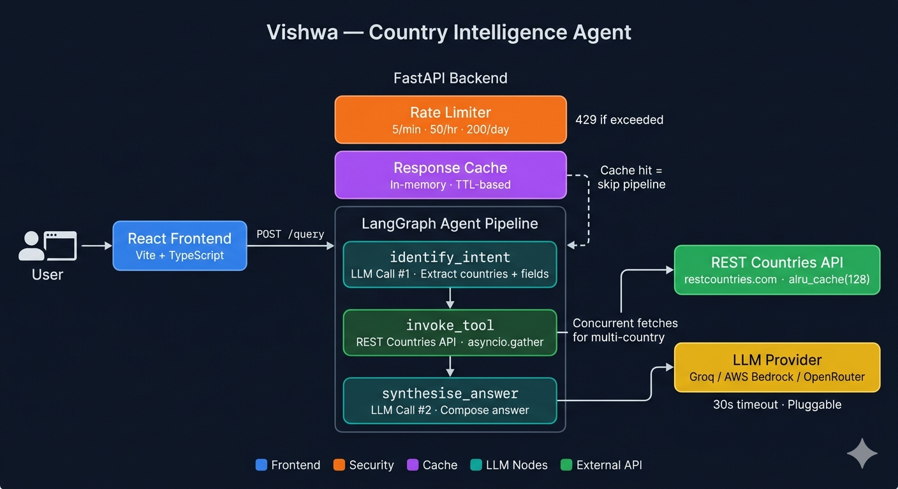

# Vishwa — Country Intelligence Agent

Vishwa is a full-stack AI agent that answers natural-language questions about countries. Ask it anything — population, capital, currency, languages, area — and it returns a grounded, factual answer powered by live data.

```
"What is the population of Germany?"                →  Germany has a population of ~84 million.
"What currency does Japan use?"                     →  Japan uses the Japanese Yen (¥).
"Tell me about Brazil — capital and area"           →  The capital is Brasília. Brazil covers 8,515,767 km².
"Germany population vs India population"            →  Germany: ~84M · India: ~1.38B
"Compare currencies of Japan and South Korea"       →  Japan: Yen (¥) · South Korea: Won (₩)
"What are the capitals of France, Spain and Italy?" →  Paris · Madrid · Rome
```

---

## Architecture



Every question passes through three layers before reaching the user:

```
User Question
      │
      ▼
┌─────────────────────────────────────┐
│         React Frontend              │
│       Vite + TypeScript             │
└──────────────┬──────────────────────┘
               │  POST /query
               ▼
┌─────────────────────────────────────┐
│          FastAPI Backend            │
│                                     │
│  ┌───────────────────────────────┐  │
│  │ Rate Limiter (SlowAPI)        │  │
│  │ 5/min · 50/hr · 200/day       │  │
│  └───────────────┬───────────────┘  │
│                  │                  │
│  ┌───────────────▼───────────────┐  │
│  │ Response Cache                │  │
│  │ In-memory · TTL-based         │  │  ← Cache hit = skip pipeline
│  └───────────────┬───────────────┘  │
│                  │ Cache miss       │
│  ┌───────────────▼───────────────┐  │
│  │   LangGraph Agent Pipeline    │  │
│  │                               │  │
│  │  identify_intent  (LLM #1)    │  │
│  │         │                     │  │
│  │  invoke_tool  (HTTP)          │  │  ← asyncio.gather for multi-country
│  │         │                     │  │
│  │  synthesise_answer  (LLM #2)  │  │
│  └───────────────────────────────┘  │
└─────────────────────────────────────┘
               │                  │
               ▼                  ▼
   REST Countries API        LLM Provider
   restcountries.com         Groq / Bedrock / OpenRouter
   alru_cache(128)           30s timeout · Pluggable
```

---

## Features

### Multi-country queries
Ask about multiple countries in a single question. All country data is fetched **concurrently** using `asyncio.gather` — fetching two countries takes the same time as fetching one.

```
"Germany population vs India population"
"Compare currencies of Japan and South Korea"
"What are the capitals of France, Spain and Italy?"
```

### Two-layer caching
**Layer 1 — Tool cache (`alru_cache`):**
REST Countries API responses are cached in-memory (up to 128 entries). Repeated questions about the same country never make a second HTTP call.

**Layer 2 — Response cache:**
Full query responses are cached with a configurable TTL. Identical questions from any user skip the agent pipeline entirely and return instantly.

### Pluggable LLM providers
Switch between three LLM backends with a single environment variable — no code changes:

| `LLM_PROVIDER` | LangChain class | Requires |
|---|---|---|
| `groq` | `ChatGroq` | `GROQ_API_KEY` |
| `bedrock` | `ChatBedrock` | `AWS_ACCESS_KEY_ID`, `AWS_SECRET_ACCESS_KEY`, `AWS_REGION` |
| `openrouter` | `ChatOpenAI` | `OPENROUTER_API_KEY` |

### Rate limiting
Stacked rate limits per IP — harder to abuse than a single window:
- 5 requests per minute
- 50 requests per hour
- 200 requests per day

### LLM call timeouts
Both LLM calls (intent + synthesis) are wrapped in a 30-second `asyncio.timeout`. A slow or unresponsive provider fails fast with a `504` rather than blocking the worker indefinitely.

### Graceful error handling

| Scenario | Behaviour |
|---|---|
| No country identified | Clear message, no LLM call made |
| Country not found in API | Tool error propagated cleanly |
| One of multiple countries fails | Successful data returned, gap noted in answer |
| Out-of-scope fields (e.g. potato price) | Silently dropped in Node 1, not mentioned in answer |
| Controversial query (war, politics) | Factual country data only, no commentary |
| Rate limit exceeded | `429` → "Too many requests, please wait" |
| LLM timeout | `504` → "Agent timed out, please try again" |
| Backend unreachable | Network error message |

### Request correlation IDs
Every request gets an 8-character UUID prefix in logs:
```
[a3f9] Intent | countries=['France'] | fields=['capital']
[a3f9] Tool   | country=France | keys=[...]
[a3f9] Synthesis complete | chars=52
```
Filter by ID to trace a single request across all three pipeline nodes.

---

## Tech stack

| Layer | Technology |
|---|---|
| Frontend framework | React 18 + Vite 5 + TypeScript |
| Styling | Tailwind CSS |
| Backend framework | FastAPI + Uvicorn |
| Agent framework | LangGraph |
| LLM abstraction | LangChain (`BaseChatModel`) |
| Country data | REST Countries API (public, no auth) |
| LLM providers | Groq · AWS Bedrock · OpenRouter |
| Rate limiting | SlowAPI |
| Async caching | `async-lru` (`alru_cache`) |
| Deployment | Docker · Railway · AWS Lambda (Mangum) |

---

## Project structure

```
vishwa/
├── backend/
│   ├── app/
│   │   ├── main.py              # App wiring — middleware, exception handlers, routes
│   │   ├── schemas.py           # Pydantic request/response models
│   │   ├── agent/
│   │   │   ├── constants.py     # ALL_FIELDS set
│   │   │   ├── graph.py         # LangGraph StateGraph
│   │   │   ├── nodes.py         # Three pipeline nodes
│   │   │   ├── prompts.py       # All LLM prompt templates
│   │   │   ├── state.py         # AgentState TypedDict
│   │   │   └── tools.py         # REST Countries API client + alru_cache
│   │   ├── api/
│   │   │   ├── lifespan.py      # Startup / shutdown lifecycle
│   │   │   └── routes/
│   │   │       ├── query.py     # POST /query
│   │   │       └── ops.py       # GET /health, /info, /cache/info, DELETE /cache
│   │   ├── cache/
│   │   │   ├── backend.py       # Cache implementation
│   │   │   └── config.py        # get_cache() / close_cache()
│   │   ├── config/
│   │   │   └── settings.py      # App settings via os.getenv
│   │   └── providers/
│   │       └── factory.py       # LLM provider factory — get_llm()
│   ├── tests/
│   │   └── test_agent.py        # All nodes mocked — no API keys needed
│   ├── requirements.txt
│   ├── Dockerfile
│   └── .env.example
│
└── frontend/
    ├── src/
    │   ├── components/          # Header, MessageBubble, ChatInput, EmptyState, SuggestedQuestions
    │   ├── hooks/
    │   │   └── useChat.ts       # Chat state — send, cancel, clear, error handling
    │   ├── lib/
    │   │   └── api.ts           # ApiError class + queryCountry()
    │   └── types/index.ts
    ├── package.json
    └── .env.example
```

---

## Getting started

### 1. Backend

```bash
cd backend
pip install -r requirements.txt
cp .env.example .env          # set LLM_PROVIDER and your API key
uvicorn app.main:app --reload
```

Backend runs at **http://localhost:8000**. Visit `/docs` for the interactive Swagger UI.

### 2. Frontend

```bash
cd frontend
npm install
cp .env.example .env          # VITE_API_URL defaults to /api (proxied to localhost:8000)
npm run dev
```

Frontend runs at **http://localhost:5173**.

---

## API

### `POST /query`

```jsonc
// Request
{ "question": "What languages are spoken in Switzerland?" }

// Response
{
  "answer": "Switzerland has four official languages: German, French, Italian, and Romansh.",
  "countries": ["Switzerland"],
  "fields": ["languages"]
}
```

### `GET /health` — liveness probe
### `GET /info` — active provider and model info
### `GET /cache/info` — cache hits, misses, hit rate
### `DELETE /cache` — clear response cache (admin)

---

## Running tests

```bash
cd backend
pytest tests/ -v
```

All LLM and HTTP calls are mocked — no API keys needed to run the test suite.

---

## Deployment

### Docker

```bash
docker build -t vishwa-backend .
docker run -p 8000:8000 --env-file .env vishwa-backend
```

### Railway

```bash
railway up
```

### AWS Lambda

The backend includes a `Mangum` handler for serverless deployment. See `serverless.yml` for configuration.

---

## Known limitations and trade-offs

### No conversation memory
The agent has no memory between requests. Each question is completely independent. If you ask "What is the capital of France?" and follow up with "What about its population?" — it won't know what "it" refers to. Adding memory would require storing conversation history in `AgentState` and passing it through the pipeline on every turn.

### Free tier LLM (Groq)
Currently configured for Groq's free API tier, which has its own rate limits independent of the application-level rate limiter. For production workloads, switch to a paid tier or AWS Bedrock for predictable capacity and latency SLAs.

### In-memory cache only
The response cache resets on every server restart. In a multi-instance deployment behind a load balancer, each instance maintains its own separate cache — there is no shared state. A Redis backend would be needed for horizontal scaling.

### Single data source
All country data comes from one external API — `restcountries.com`. If that API is unavailable, every query fails at the tool layer. There is no fallback data source or local snapshot.

### No authentication
The API is open — any client that knows the URL can query it. For public production deployment, add API key authentication or JWT tokens before exposing this publicly.
